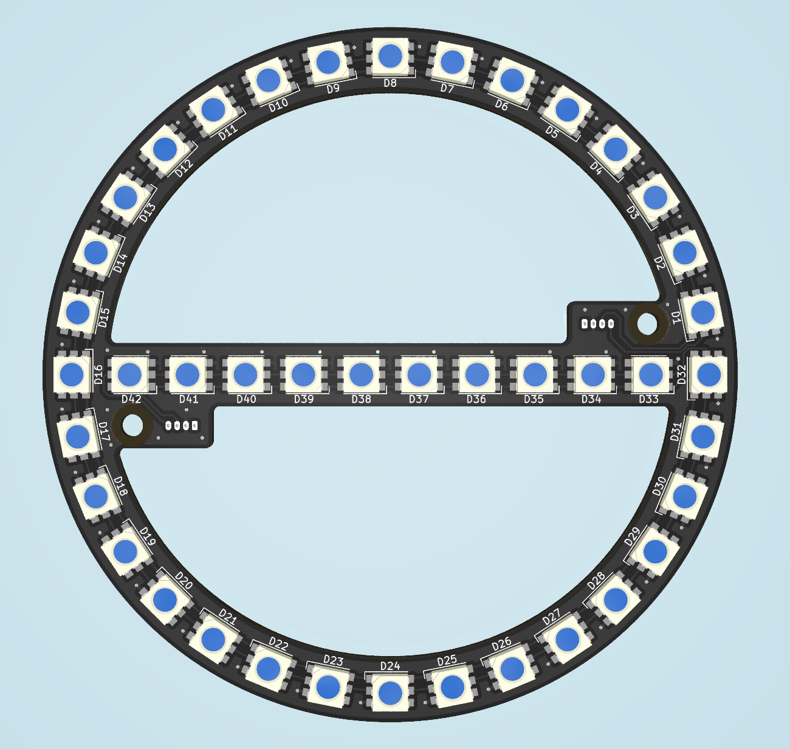

# LED ring with crossbar

This ring contains 32 addressable LEDs and 10 also addressable LEDs as crossbar.

This is part of [Stepper-Locking-System](https://github.com/netz39/Stepper-Locking-System).

The CAD models are here: [OnShape](https://cad.onshape.com/documents/e2d30949799f050b252632fe/w/72c412dc9c1a5764811a9783/e/a3e88e734353b2ea9fe2e731)
--

Requirements for v1.0
--

* sychronous addressable LEDs (APA102 or SK9822)
* two connectors, one input and one output for cascading
* two mounting holes

Pictures (v1.0)
--

